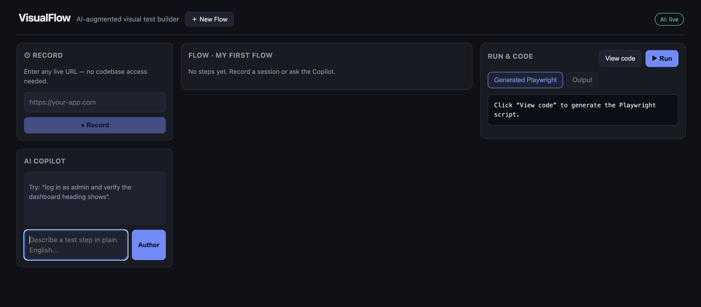

# VisualFlow — AI-Augmented Visual Test Builder

[](./LICENSE)
[]()
[]()
[]()
[]()

> Record actions on **any live URL** (no source-code access required) and an AI
> agent writes the automated test behind the scenes. Edit the flow visually,
> let the AI add steps from plain English, run it on Playwright, and get a
> plain-language root-cause when something breaks.
>
> Also ships as an **MCP server**, so Claude inside an IDE can *be* the agent.

VisualFlow is a portfolio project at the seam of **senior QA practice** and
**applied AI agents**: the test-orchestration domain model is encoded as
software, and a multi-agent layer sits on top of it.



---

## The two ways to build a test

### Option 1 — Record against a live URL (the QA path)
A manual tester opens VisualFlow, pastes the URL of a *deployed* app, and clicks
**Record**. A real browser launches; every click, keystroke, and navigation is
captured. For each interaction VisualFlow synthesizes a **resilient locator**
from the accessibility tree (role + accessible name, label, placeholder,
`data-testid`, visible text) — never from source the QA can't see. The
**Refiner agent** then turns the raw event stream into a clean, labelled flow
with suggested assertions.

### Option 2 — Claude-in-IDE as the agent (the MCP path)
VisualFlow exposes an **MCP server**. Point an MCP-capable client (e.g. Claude
Code / Claude in your IDE) at it and Claude can drive the whole engine through
tools: `start_recording`, `refine_recording`, `author_flow`, `generate_code`,
`run_flow`, `heal_selector`. The web UI and Claude share one backend.

---

## The AI agent layer (the headline)

| Agent | Job | Model |
|-------|-----|-------|
| **Author** | Plain-English instruction → schema-valid steps | `claude-opus-4-8` |
| **Refiner** | Raw recorded events → clean flow + assertions | `claude-opus-4-8` |
| **Healer** | Broken locator + page elements → best new locator | `claude-haiku-4-5` (fast, runs often) |
| **Analyst** | Failure output → plain-language root cause + category | `claude-opus-4-8` |

Every agent's output is **validated against the Flow schema** (zod) before it
touches a flow — a hallucinated step is rejected, not shipped.

**Real SDK + mock fallback:** set `ANTHROPIC_API_KEY` for live calls; with no
key, the agents run deterministic mocks so the app fully works in a demo without
spending tokens.

---

## Quick start

```bash
npm install
cp .env.example .env        # optional: add ANTHROPIC_API_KEY for live AI
npm run dev                 # server on :4000, client on :5173
```

Open http://localhost:5173.

To enable real browser recording / execution:

```bash
npx playwright install
```

(Without browsers installed, the recorder and runner report cleanly and the
generated Playwright code is still shown — every other feature works.)

### Using the MCP server with Claude

```jsonc
// claude_desktop / IDE MCP config
{
  "mcpServers": {
    "visualflow": {
      "command": "node",
      "args": ["./mcp/dist/index.js"],
      "env": { "VISUALFLOW_URL": "http://localhost:4000" }
    }
  }
}
```

Build it first with `npm run build`.

